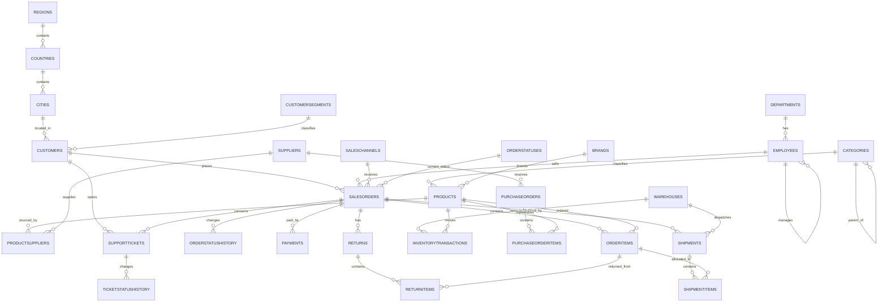

# RetailOperations3NFDB — Third Normal Form Design

## Business domain

This database models a realistic multi-region retail operation:

- customers and geographic locations
- employees and management hierarchy
- products, categories, brands, suppliers, and supplier quotations
- sales orders, line items, lifecycle history, payments, and shipments
- warehouses and inventory movements
- purchase orders and receipts
- support tickets and ticket status history
- product returns and refunds

## Why the design is in 3NF

### First normal form

- Every column contains a single value.
- Repeating groups such as order products, shipment products, and return products are stored in child tables.
- Every table has a primary key.

### Second normal form

- Tables with composite keys, such as `ProductSuppliers` and `ShipmentItems`, contain attributes that depend on the complete composite key.
- Line-level facts are separated from header-level facts.

### Third normal form

- Descriptive data is stored once in lookup or master tables.
- Region data is not repeated in customers; customers reference cities, cities reference countries, and countries reference regions.
- Product category and brand names are not repeated in order lines.
- Status names are stored in status tables instead of transactional tables.
- Employee department names are not stored in employees.
- Supplier details are not stored in purchase order items.
- Derived analytics such as order revenue, customer lifetime value, running stock, ranks, and percentages are calculated by queries rather than stored redundantly.

## Important relationships

## Dataset size

The seed script creates approximately:

- 160 customers
- 33 employees
- 100 products
- 20 suppliers and 300 product-supplier relationships
- 900 sales orders and 3,600 order items
- payment attempts, refunds, status histories, shipments, and split shipments
- 7,800 inventory movements including opening balances
- 240 purchase orders
- 320 support tickets with lifecycle history
- returns and return items

The data is deterministic, so every learner receives the same results.
